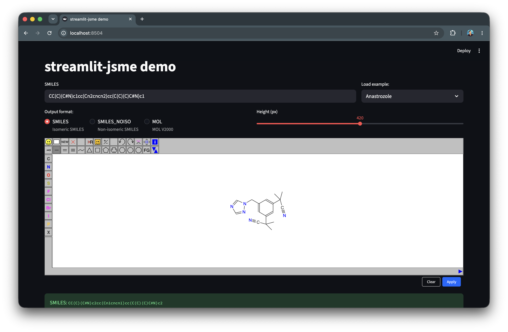

# streamlit-jsme

A Streamlit V2 custom component that embeds the [JSME Molecule Editor](https://jsme-editor.github.io/) — a pure-JavaScript 2D structure drawing tool — directly into a Streamlit app.

Because it uses the Streamlit V2 component API (no iframe), JSME runs in the **main page DOM**, avoiding the WASM/CSP restrictions that affect iframe-based editors in Snowflake SiS and similar managed environments.



## Installation

```bash
pip install streamlit-jsme
```

## Examples

### Component with user input

```python
import streamlit as st
from streamlit_jsme import st_jsme

st.set_page_config(layout="wide")
st.title("`streamlit-jsme`")

st.header("Component with user input")

DEFAULT_MOL = "CC(=O)Oc1ccccc1C(=O)O"  # Aspirin

molecule = st.text_input("Molecule", DEFAULT_MOL)
smile_code = st_jsme(molecule)
st.markdown(f"SMILES: ``{smile_code}``")
```

### Components with custom height

```python
st.header("Components with custom height")

ASPIRIN = "CC(=O)Oc1ccccc1C(=O)O"

st_jsme(ASPIRIN, height=300, key="small")
st_jsme(ASPIRIN, height=500, key="large")
```

### Non-isomeric (stereo-stripped) SMILES

Use `format="SMILES_NOISO"` to strip stereochemistry from the output.

```python
st.header("Non-isomeric SMILES")

molecule = st.text_input("Molecule", "CC(=O)Oc1ccccc1C(=O)O")
result = st_jsme(molecule, format="SMILES_NOISO", key="noiso")

if result:
    st.success(f"Non-isomeric SMILES: `{result}`")
```

### MOL file output

```python
st.header("MOL file")

molecule = st.text_input("Molecule", "CC(=O)Oc1ccccc1C(=O)O")

with st.echo():
    molfile = st_jsme(molecule, format="MOL", key="mol_editor")

if molfile:
    st.code(molfile, language="text")
    st.download_button("Download .mol", molfile, file_name="molecule.mol",
                       mime="chemical/x-mdl-molfile")
```

### Loading examples with a selectbox

Use an `on_change` callback to keep the text input and the editor in sync when
picking an example — this avoids the `value=` / `key=` conflict in Streamlit's
session state.

```python
import streamlit as st
from streamlit_jsme import st_jsme

EXAMPLES = {
    "(none)":      "",
    "Aspirin":     "CC(=O)Oc1ccccc1C(=O)O",
    "Caffeine":    "Cn1c(=O)c2c(ncn2C)n(C)c1=O",
    "Anastrozole": "CC(C)(C#N)c1cc(Cn2cncn2)cc(C(C)(C)C#N)c1",
}

def _on_example_change():
    st.session_state["mol_input"] = EXAMPLES[st.session_state["example_choice"]]

col_in, col_ex = st.columns([3, 1])
with col_ex:
    st.selectbox("Load example:", list(EXAMPLES.keys()),
                 key="example_choice", on_change=_on_example_change)
with col_in:
    molecule = st.text_input("SMILES", key="mol_input",
                             placeholder="Paste a SMILES or pick an example…")

smiles = st_jsme(molecule, height=420, key="jsme_main")

if smiles:
    st.success(f"SMILES: `{smiles}`")
```

## API

```python
st_jsme(
    molecule: str = "",       # Initial SMILES to display in the editor
    *,
    height: int = 420,        # Canvas height in pixels
    format: str = "SMILES",   # Output format: "SMILES", "SMILES_NOISO", or "MOL"
    key: str | None = None,   # Unique key for multi-instance support
) -> str
```

Returns the molecular representation in the requested format after the user clicks
**Apply**, or `""` if nothing has been applied yet.

### Output formats

| `format` | Method | Description |
|----------|--------|-------------|
| `"SMILES"` (default) | `smiles()` | Isomeric SMILES — includes E/Z and R/S stereo |
| `"SMILES_NOISO"` | `nonisomericSmiles()` | Stereo-stripped SMILES |
| `"MOL"` | `molFile()` | MDL MOL V2000 block with 2D coordinates |

### Buttons

| Button | Behaviour |
|--------|-----------|
| **Apply** | Sends the current drawing to Streamlit in the selected format |
| **Clear** | Resets the canvas and clears the returned value |

## Notes

- JSME is loaded from `unpkg.com` (CDN) on first render — requires internet access in the user's browser.
- The editor fills the **full column width** at render time and re-adapts when the browser window is resized (debounced, 150 ms).
- The editor uses Streamlit CSS variables (`--background-color`, `--text-color`) so it adapts automatically to light and dark themes.
- Only one JSME instance per page is supported in this version.
- The `molecule` prop is only applied to the editor when it actually changes, so drawing and clicking **Apply** does not reset the canvas on the subsequent rerun.

## Author

[Chanin Nantasenamat](https://www.linkedin.com/in/chanin-nantasenamat/) ([YouTube](https://youtube.com/dataprofessor) | [X](http://x.com/thedataprof) | [GitHub](https://github.com/dataprofessor/))

## License

MIT
